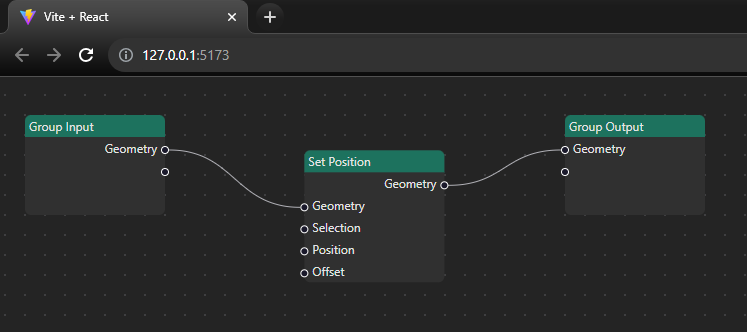

# Geometry Node Graph

Preview Geometry Nodes on web using React

## Getting Started

1. Clone this project: `git clone https://github.com/whoisryosuke/geometry-node-graph.git`
1. Install dependencies: `yarn`
1. Start the dev server: `yarn dev`

Open the app in your web browser, you should see a node graph.

## Previewing your nodes

This app works by using JSON files with geometry node data exported from Blender using a custom plugin (TBD). But I included the WIP script below, it should work to export some basic graphs (haven't tested stuff like custom nodes, groups, etc).

1. Save your file somewhere.
1. Select the object with the geometry nodes modifier.
1. Go to the Scripting tab in Blender (or change one of the windows to scripting)
1. Create a new script (click the "New" button on top of window)
1. Paste in [the script from here](scripts/export-geometry-nodes.py)
1. Run the script.
1. Look inside the folder where your file is saved, you should a JSON file
1. Copy and paste that JSON file into the `src/data/` folder of this app.
1. Open up the `src/App.tsx` and swap your JSON filename for the one imported in there.
1. Hard refresh the browser/app to see changes.

## How it works

This app uses react-flow to display the node graph. It provides a lot of nice stuff out of the box, like the zooming and panning.

The nodes are generated from a JSON file that is exported from Blender using a custom Python script. It basically reads the geometry node data and creates a JSON file with the data.

> Interested in learning more? [Check out my blog](https://whoisryosuke.com/blog), where I break down how this works.

## Release

1. Bump version in `package.json`
1. `yarn build`
1. `npm publish`
